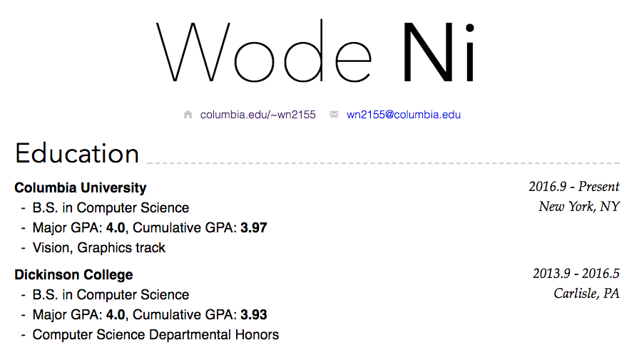

WangLei-markdown-cv
================

A curriculum vitae template that lets you write your cv in Markdown and supports both HTML and PDF output formats. To generate the cv, we use [Jekyll](https://jekyllrb.com/).

***

## Clone from [nimo-markdown-cv repo](https://github.com/wodeni/nimo-markdown-cv)

